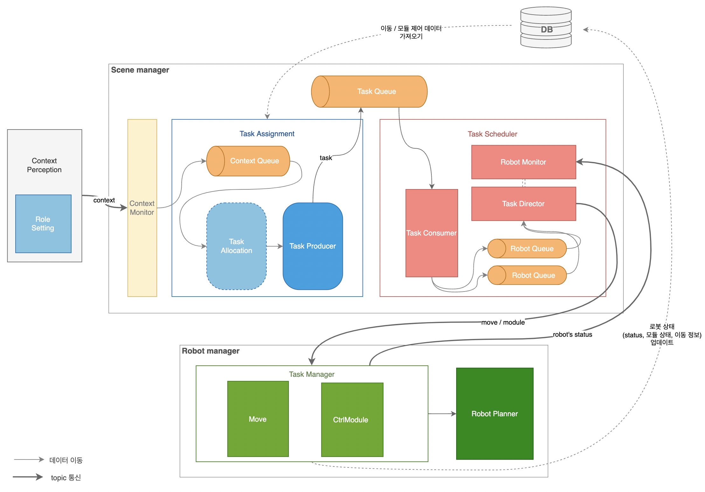

# Architecture




## 1. Task Assignment
Context Queue로부터 context와 필요한 모듈 정보를 가져와 필요한 로봇을 할당하고 Task를 생성

| 상태 | 설명 |
|--|--|
| **Task Allocation** | Task에 필요한 로봇을 할당하는 확률적 메커니즘 동작 |
| **Task Producer** | Task에 필요한 모든 로봇의 Action을 Task 단위로 묶어 Task Queue에 삽입 |

## 2. Task Scheduler
| 상태 머신 | 설명 |
|--|--|
| **Task Consumer** | Task Queue의 Task를 가져와 각 로봇 별 Robot Queue에 Action을 삽입 |
| **Robot Monitor** | 각 로봇의 상태를 토픽으로 수신하여 IDLE 로봇 집합 업데이트 |
| **Task Director** | Robot Queue 생성/삭제하고, Robot Queue에서 Action을 가져와 각 로봇에 토픽 발행 |


<br/>


# Prerequisites

## 1. System
테스트를 진행했던 서버 환경은 다음으로 구성되어 있습니다. (가상머신을 사용하여 테스트할 때에는 multipass를 사용해 환경 세팅)
- **Operating System**: Ubuntu 20.04.6 LTS
- **Kernel**: Linux 5.4.0-200-generic
- **ROS version**: noetic

## 2. Environment Variable
dotenv를 사용해 환경변수 저장 (데이터베이스에 접근 시 필요)
- **src/ 폴더 아래에 .env 파일을 추가해주세요**
- 아래의 내용이 .env에 포함되어야 하고, 각 변수값은 수정해야 합니다.
```
DB_HOST={server_ip}
DB_USER={granted_user}
DB_PASSWORD={granted_password}
DATABASE={schema_name}
```

## 3. ~/.bashrc
```bash
export ROS_MASTER_URI=http://{server-ip}:11311
export ROS_HOSTNAME={server-ip}
export TURTLEBOT3_MODEL=waffle
```

## 4. roscore
```bash
roscore
```

<br/>

# Run
```bash
## scene manager 실행
git clone https://github.com/lnalice/simple-robot-scene-manager.git
cd simple-robot-scene-manager
python3 ./src/scene_manager.py

## context를 publish해서 test할 때
python3 ./src/test/list_publisher.py # 방향키로 데이터 선택하고, 엔터키로 publish
```
<br/>

# Communication

## 1. Topic

| 토픽 | 설명 | 메시지 데이터 분류
|--|--|--|
|**/react/commander** | 상황ID 및 필요한 모듈 종류와 개수 전달받음 | Context |
|**/task_scheduler/{robot_name}** | 로봇 별 이동 및 모듈제어를 명령 | Action |
|**/task_scheduler/robot_status** | 로봇 상태를 받음 | Status |

## 2. Queues
| 분류 | 설명 |
|--|--|
| **Context Queue** | Context를 담는 Queue|
| **Task Queue** | Task를 담는 Queue |
| **Robot Queue** | Action을 담는 Queue|

## 3. Data
아래의 표는 토픽으로 전달되는 메시지 혹은 큐를 거치는 데이터에 대해 설명합니다.

| 분류 | 자료형 | 데이터 구조 | 예시 |
|--|--|--|--|
| Context | String | `context` `모듈 종류` `필요한 모듈 수` ... | "friend table 1 chair 2"|
| Task | List | [ `Action`, `Action`, ... ] |["MOVE tb3_0 10 0.07 -0.01 0", "MODULE tb3_0 1380 650 0"]|
| Action(MOVE) | String | MOVE `로봇` `seconds` `직진속도`  `각속도` `delay(sec)` | "MOVE tb3_0 10 0.07 -0.01 0" |
| Action(MODULE) | String | MODULE `로봇` `수직 모터 각도차` `수평 모터 각도차` `delay(sec)`| "MODULE tb3_0 1380 650 0"|
| Status | String | `Action` \| IDLE   `로봇` | "IDLE tb3_0", "MOVE tb3_1" |


# File Structure
```
├── CMakeLists.txt
├── package.xml
├── assets
│   ├── sm_graph1.png
│   └── sm_graph2.png
└── src
    ├── dao
    │   ├── db
    │   │   ├── config.py
    │   │   └── connection.py
    │   ├── RobotDao.py
    │   ├── contextModuleDao.py
    │   ├── contextMoveDao.py
    │   ├── moduleDao.py
    │   ├── moveDao.py
    │   └── sceneModuleDao.py
    ├── helper
    │   ├── context2task.py
    │   ├── moduleCalculator.py
    │   └── uiTopicInterpreter.py
    ├── state_machines
    │   └── context_monitor.py
    ├── tasks
    │   ├── config
    │   │   └── actionList.py
    │   ├── logic
    │   │   └── random_allocation.py
    │   ├── robot_monitor.py
    │   ├── task_allocation.py
    │   ├── task_consumer.py
    │   ├── task_director.py
    │   └── task_producer.py
    ├── test
    │   ├── commands.csv
    │   └── list_publisher.py
    ├── scene_manager.py
    ├── task_assignment.py
    └── task_scheduler.py
```

- **dao/**
    - **db/\*** : 데이터베이스에 연결을 위해 설정을 하고 연결 3회 시도
    - **\*Dao.py**: MySQL에 query를 보내, *INSERT, UPDATE, SELECT* 등 실행

- **helper/**
    - **moduleCalculator.py**: 모터 회전각도 변위 <-> 모듈의 상태 변환
    - **context2task.py**: 모터 회전각도 변위 <-> 모듈의 상태 변환

- **state_machines/**
    - **context_monitor.py**: 모터 회전각도 변위 <-> 모듈의 상태 변환

- **tasks/**
    - **config/***: Task 할당에 필요한 설정
    - **logic/***: Task Allocation 확률적 메커니즘 저장
- **test/**
    - **command.csv**: 토픽 발행 시, 메시지 데이터에 담는 값 정리
    - **list_publisher.py**: command.csv 데이터를 std_msgs/String으로 담아 토픽 발행